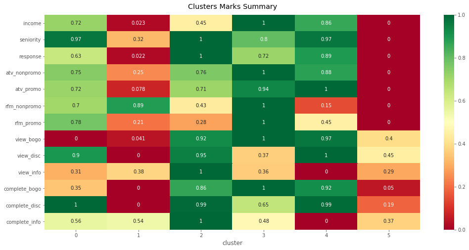

# Starbucks Customers Segmentation

## 1. Project Overview

[Starbucks](https://www.starbucks.com/) has published sets of simulated data that mimics customer behavior on the [Starbucks Rewards](https://www.starbucks.com/rewards/) mobile app. Starbucks operates more than 30,000 retail stores in 80 markets around the world [[1]](https://www.starbucks.com/about-us/company-information/starbucks-company-profile) making them a big player in a vigorously competitive industry. In a way that creates competitive advantage, the company is looking at the prospect of using data collected on customer behaviors to better engage them with promotions.

The company is assumed to currently promote products to customers with no prior knowledge of their segments. It is possible hence to analyse the data to find patterns in customer behaviors. This helps the company in aiming and tailoring their marketing efforts and resources to consumers who exhibit similar characteristics and are considered most likely to opt in for business’s offerings. This form of target marketing is important because it helps the company by maximizing revenue while maintaining promotional campaigns cost smartly low. To do this, an unsupervised learning technique will be used to cluster customers into groups that can be be investigated separately to better understand their qualities and engage them accordingly.

In this project, which is to be submitted as a [Udacity's Data Scientist](https://www.udacity.com/course/data-scientist-nanodegree--nd025?utm_source=gsem_brand&utm_medium=ads_n&utm_campaign=8305564283_c&utm_term=85684766815_sa&utm_keyword=udacity%20data%20science_e&gclid=CjwKCAiA3abwBRBqEiwAKwICA4Cgp53FH7YGsEl-Jd_7to46zhiH3nTGxkv4fpPBaND6bK1tASWO-BoCUeoQAvD_BwE) capstone project, I attempted to propose a solution that helps the company in forming better understanding of their customer base using the published data. An unsupervised learning technique is used  to segment customers and measure how each segment behave. In particular, [K-Means](https://scikit-learn.org/stable/modules/generated/sklearn.cluster.KMeans.html) clustering algorithm is used. The provided dataset of courses went through different phases at first before being ready for modeling. Starting with cleaning and ending with the final dataset grouped by customer profiles with their data aggreated.

Here’s a high-level overview of the workflow followed in this project:

1.  Define the problem in-hands and measurement criterias.
2.  Explore, understand, and clean the provided datasets.
3.  Prepare final dataset grouped by customers.
4.  Transform final dataset appropriately before fitting model.
5.  Fit model on final dataset and predict cluster labels.
6.  Explore distributions among formed clusters.
7.  Discuss outcomes and make recommendations.

## 2. Content

### 2.1. Files

* `notebook.ipynb`: Jupyter notebook containing all code for this project and showcasing the proposed solution to the problem.
*  `data/portfolio.json` Dataset containing meta data about the promotions offered by the company to their customer base.
* `data/profile.json` Dataset containing demographic data about the customers enrolled in the reward program via the mobile app.
* `data/transcript.json` Dataset containing time-stamped records for transactions, offers received, offers viewed, and offers completed by customers.
* `images/` File containing assistive images.

### 2.1. Data

Published dataset contains simulated data that mimics customer behaviors on the Starbucks Rewards mobile app. Once every few days, Starbucks sends out an offer to users of the mobile app. An offer can be merely an  _informational_  advertisement or an actual offer such as a  _discount_  or  _buy-one-get-one-free_. This dataset is a simplified version of the real Starbucks app because the underlying simulator only has one product whereas Starbucks actually sells dozens of products.

## 3. Results

With the help of the plot above and collected data during the project, summary of each cluster is as follows:

**Cluster**  `0`: This cluster represents good business value to the company. Their income is fairly high, they are senior members in the program, and they respond fairly quick to offers. They spend an average of  $11.60 and  $17.25 in non-promo and promo periods respectively exhibiting an increase in RFM score of 46% between the two periods. This cluster of customers is most interested in "disc" offers being with the best completion rate out of all clusters for these type of offers. They respond fairly to "info" offers, but not so for "bogo" offers.

**Cluster**  `1`: This cluster seems to be formed of low-income, low-spenders, and recent-members who does not seem to be tempted by any offer type. Their average spend in both non-promo and promo periods is almost  $7.50 exhibiting an increase in RFM score of only 6% between the two periods.

**Cluster**  `2`: This cluster of customers respond very well to all offers type. In a good way too, with an average spend of  $8.92 and  $17.20 in non-promo and promo periods respectively exhibiting an increase in RFM score of 81% between the two periods. They are the most senior members of the program and the fastest to respond to offers. Worth noting in particular, this cluster of customers respond extremely well to "info" offers.

**Cluster**  `3`: This cluster of customers arguably represents the best business value for the company non-promo periods. They are the highest spenders in non-promo periods with an average spend of //$16.67 miles ahead of most clusters. Their avergae spend increases to second highest  $20.34 in promo periods. They have the highest income of all clusters and they respond to offers fairly fast. They are most interested in "bogo" and to a lesser extent "disc" offers, but not so much so for "info" offers.

**Cluster**  `4`: This cluster of customer seems to be only active during promo periods. Their average spend in non-promo is low  $5.66 but that jumps to highest average spend among clusters in promo periods  $21.23 exhibiting an increase in RFM score of 226% between the two periods. They are equally highly interested in "bogo" and "disc" offers but not tempted by "info" offers at all. They are formed of high income and senior members who respond fast to offers.

**Cluster**  `5`: This cluster seems to be formed of customers who are completely inactive during non-promo periods with anvrage spend of lowest  $1.23. That increase to, still lowest,  $6.48 average spend in promo periods. Hence an increase in RFM score of 360% but that is due to very low average spend in non-promo periods to begin with. Their view and completion rates are among the lowest if not the lowest. This affects their response score being also among the lowest. Also, does not exhibit a pattern by which it can be said they favor a specific offer type. This cluster of customers seem to be a prime target for further and separate investigation.

## 4. Dependencies 

The notebook was written using **python 3.6.10**. No extra packages are necessary beyond the Anaconda distribution. Main packages used are; **numpy 1.18.1** and **pandas 0.25.3** for data manipulating, **scikit-learn 0.22.1** for machine learning, and **matplotlib 3.1.1** and **seaborn 0.9.0** for visualizations.

## 5. Acknowledgements
-   [Udacity](https://www.udacity.com/)  for tremendous guidance and mentoring.
-   [MiSK Academy Scholarships](https://misk.org.sa/miskacademy/)  for providing this great opportunity.
-   [Starbucks](https://www.starbucks.com/)  for providing data to work with in this project.

## 6. License
This work is published with love from [Saudi Arabia](https://www.visitsaudi.com/en) under [Apache License 2.0](https://github.com/alghsaleh/disaster-response/blob/master/LICENSE).
